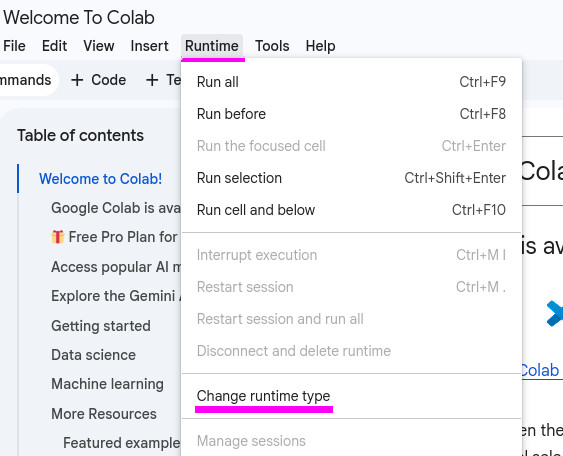
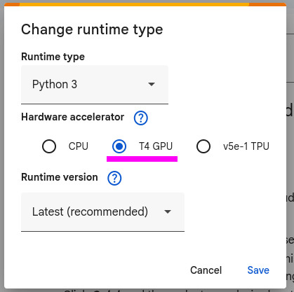

## 👩‍💻👨‍💻 Código en Jupyter Notebook

### 🚀 Uso

Para armar la imagen de Docker
```bash
./build
```

Para correr el contenedor
```bash
./run
```

Si quieres crear un túnel de SSH para conectarte hacia otra máquina remota
```bash
./tunnel <usuario@host>
```

### 🛠️ Requisitos

#### 🪟 Windows (con WSL2)

* Windows 10/11 con [WSL2 activo](https://learn.microsoft.com/en-us/windows/wsl/install)
* GPU con capacidad de cómputo 6.1 o superior (Pascal o superior)
* Driver de NVIDIA [(1)](https://www.nvidia.com/en-eu/software/nvidia-app/)
  [(2)](https://www.nvidia.com/en-eu/drivers/) más actualizado, al menos 555
* Distribución WSL2 Ubuntu 24.04 (recomendado, pero es posible usar otra)
* [CUDA Toolkit 12.9.0](https://developer.nvidia.com/cuda-12-9-0-download-archive?target_os=Linux&target_arch=x86_64&Distribution=WSL-Ubuntu&target_version=2.0&target_type=runfile_local)
  o más nuevo, dentro de WSL2
* [Docker Desktop](https://www.docker.com/products/docker-desktop/) en Windows con
    + Integración con WSL2 Ubuntu activa
        - `configuración > Usa WSL 2`
        - `configuracion > recursos > integración WSL > Activa tu distro`
    + Paso de GPU (que se permita `--gpus all`)
* [`docker-ce-cli`](https://docs.docker.com/engine/install/ubuntu/) en WSL2 (es
  importante **no** administrar el servicio desde WSL2, para eso es Docker
  Desktop en Windows, necesitamos `docker-ce-cli` pero no hay que interactuar
  con `systemctl` ni `docker`, `docker-ce` o `docker-ce-rootless-extras`)
* Asegúrate que tu usuario esté en el grupo `docker` si te faltan permisos con
  `sudo usermod -aG docker $USER`

Como se ejecuta en un contenedor, no es necesario tener Python ni su
paquetería, el contenedor instala su propia versión del resto de software
necesario de modo que no interactúe con el resto del sistema y tenga siempre
la misma versión de todo el software.

#### 🐧 Linux (nativo)

* Ubuntu 24.04 (u otra distribución con soporte)
* GPU con capacidad de cómputo 6.1 o superior (Pascal o superior)
* Driver de NVIDIA 555 o mayor
* CUDA Toolkit 12.9.0 o superior
* Docker Engine (CE) + CLI
* NVIDIA Container Toolkit

Como se ejecuta en un contenedor, no es necesario tener Python ni su
paquetería, el contenedor instala su propia versión del resto de software
necesario de modo que no interactúe con el resto del sistema y tenga siempre
la misma versión de todo el software.

#### 🌐 Google Colab (no recomendado)

No está recomendado ya que provoca peor reproducibilidad al no tener control
sobre la gestión de las versiones al mismo grado que en un contenedor. Puede
ser útil si no dispones de una GPU.

Ve a [Google Colab](https://colab.research.google.com/) y sube el notebook.

Activa un ambiente con GPU.





En algunas de las primeras celdas vienen comentados comandos adicionales a
ejecutar si estamos en Google Colab, los cuales se encargarán de que se
encuentre bien versionado el entorno.
